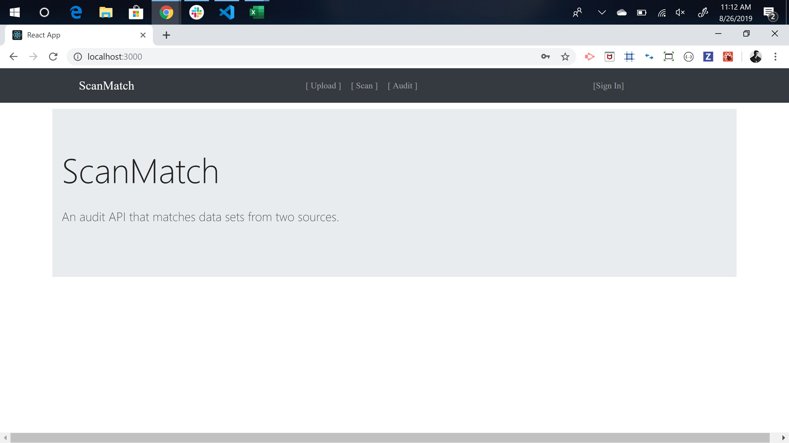
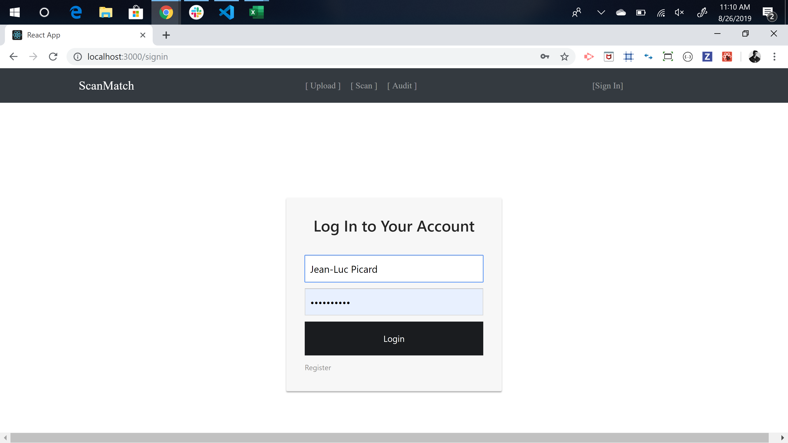
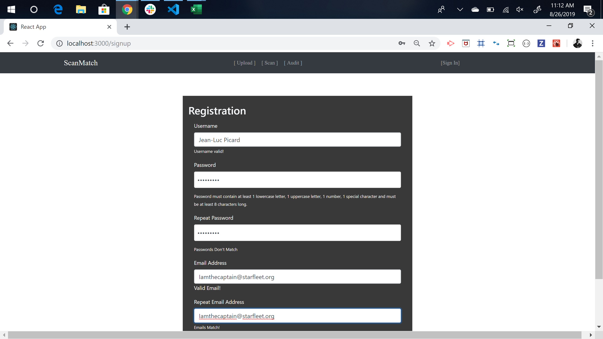
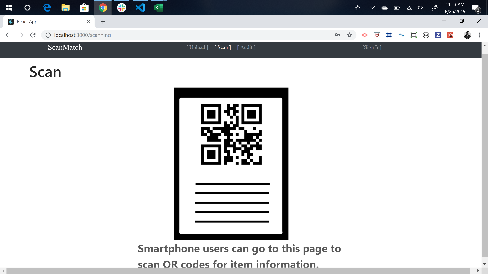
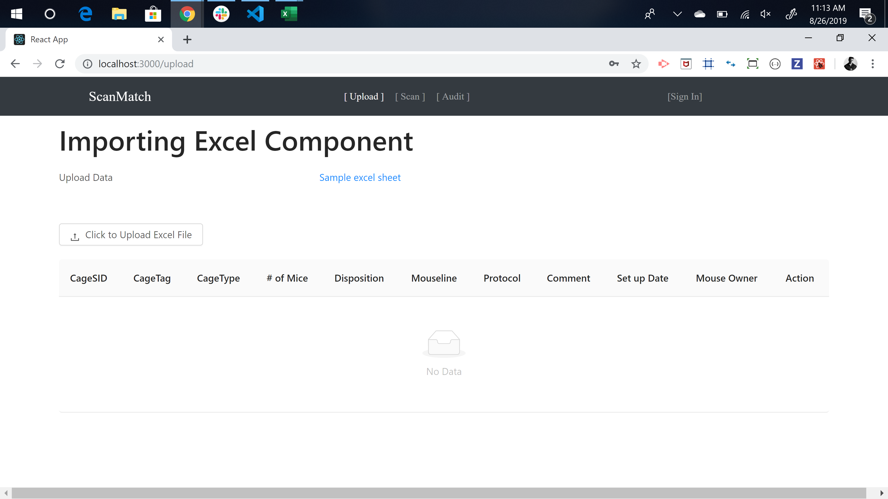
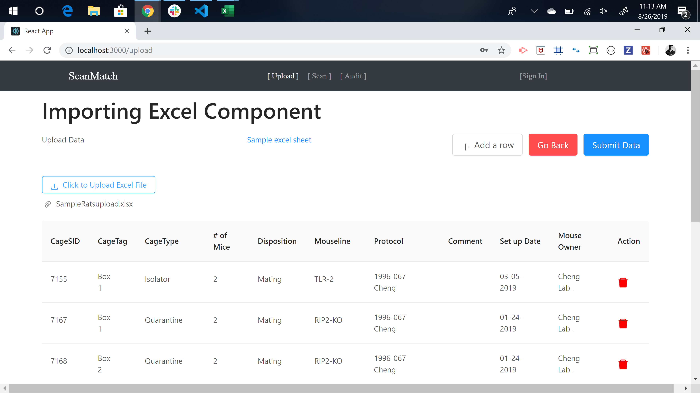
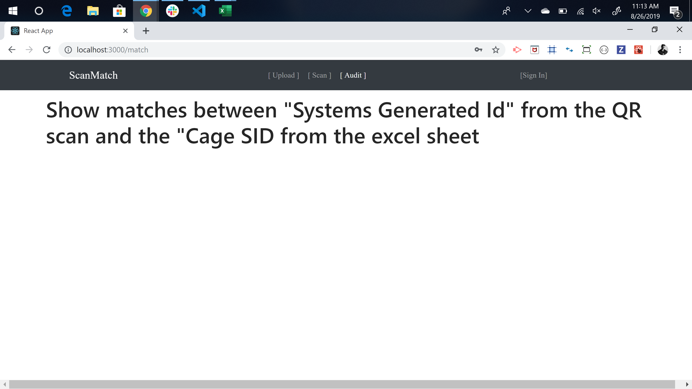

ScanMatch

ScanMatch is a full stack web application that allows users to audit their digital database against their physical inventory. Prepared for SoftMouse Inc. The user can log in or register. After logging in the user can use the QR code scanner to keep track of their physical inventory. Then the user can go to the upload page to add an excel spreedsheet of their digital inventory. On the upload page once the excel spreedsheet is uploaded the user can make changes to the form before submitting it to the database. On the audit page the user will be notified of any discrepances between the digital and physical data. 

Heroku deployed app link: https://intense-stream-50784.herokuapp.com/

Issues: 
1.) Heroku link will recieve internal server error once user attempts to interact with the backend. Backend functionalty is in progress. 
2.) POST requests not completed. Functionality is in progress. 
3.) GET requests for audit / compare collections not completed. Functionality is in progress. 

Home page

Log in

Register

QR Scanner (works on mobile device)

Upload page 

Upload page with data 

Audit page (in progress)

Tech Used: 

    1. Node.js 
    2. Express.js 
    3. React.js
    4. React-Excel-Renderer 
    5. React-Qr-Reader
    6. Mongoose / MongoDB 
    7. Cheerio 
    8. Axios 
    9. Passport
    10. Heroku

Built With: 

    VS Code 

Authors: 
 
    Omar Alcala
    Andrew Farag
    Ryan Fogle 
    Vlad Neri 
    Nick Tuso
